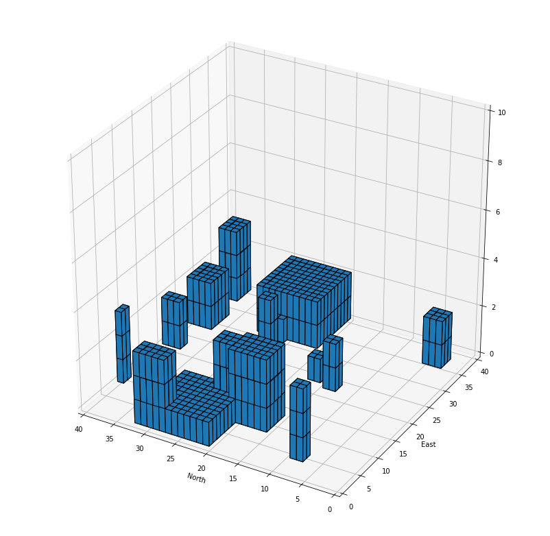

# 3D Motion Planning

The goal of this project is to plan and execute a trajectory through a 3D complex urban environment.

## Table of Contents
* [Environment](#environment)
* [Grid Search](#grid-search)
* [Graphs](#graphs)
* [Potential Field](#potential-field)
* [Receding Horizon Planning](#receding-horizon-planning)
* [Implementation](#implementation)
* [Reference](#reference)

## Environment

The drone is situated in the middle of a map which represents downtown San Francisco. The drone should take off, plan a trajectory from its current position to a goal position in the map and execute the trajectory avoiding obstacles. This is known as the motion planning problem.

The environment is a continuous space, so we should discretize it into a grid or a graph representation to be able to search through it and find a path.

The complexity of the grid/graph representation is really important in the motion planning problem. A very complex representation will represent the environment precisely but it will take too much time to search and find a path. However, if the representation is very simple, we could miss or collide with obstacles.

## Grid Search

A [grid-based](https://svn.sable.mcgill.ca/sable/courses/COMP763/oldpapers/yap-02-grid-based.pdf) representation of the environment is widely used and it can be searched using A* or other algorithms.

### 2D Grid

Instead of using the entire 3D environment, we can use a 2D grid for representing a certain altitude where the drone is going to fly.

For doing this, we can create a 2D configuration space of the environment given the obstacle data in `colliders.csv` and a safety distance that we would like to leave around obstacles.

The output should look something like this:

   

The left image shows the original map while the right image is the 2D representation at 5 meters altitude.

### 3D Grid

We can also represent the environment as a 3D grid or a 2.5D grid (limited altitude).

A 3D representation may be useful for representing a local map or small region instead of representing a global map.

However, we can change the resolution of the map to make it more or less complex depending on the situation.

Here we can see a 3D configuration space of the city with a resolution of 10 m³:

With a 2D or 3D grid of the environment we can now search a path using [A*](https://en.wikipedia.org/wiki/A*_search_algorithm) with an appropriate heuristic.

## Graphs

Graphs can also be used to discretize the world and represent the search space. A graph is a collection of nodes connected with edges so we can also plan a path that starts at a specific node and goes through the edges until a goal node.

For example, the road network is actually a graph where the intersections represent the nodes and the roads represent the edges.

### Voronoi diagram

[Voronoi diagram](https://en.wikipedia.org/wiki/Voronoi_diagram#:~:text=In%20mathematics%2C%20a%20Voronoi%20diagram,%2C%20sites%2C%20or%20generators) is a graph that breaks up the space into regions around a set of points representing obstacles so that all the points in a given region are closest to that obstacle.

We can create a graph given the edges of the Voronoi diagram where all of them represent feasible paths to navigate around obstacles and use A* algorithm to find a path from start to goal:

### Probabilistic roadmap

The [Probabilistic roadmap](https://en.wikipedia.org/wiki/Probabilistic_roadmap) creates a graph representation of the free space in the environment sampling points at random and testing them for collision. These random samples are connected to form the roadmap (graph) that can then be searched to find a path from start to goal.

Here's an example of this graph representation after sampling 500 points:

### Rapidly-exploring random trees (RRT)

[RRT](https://en.wikipedia.org/wiki/Rapidly-exploring_random_tree) is an algorithm that iteratively grows a tree from a starting position using random samples from the search space. Then, these samples are connected to the closest available node and checked for collisions.

A tree is a special case of a graph with directed edges and only with one path to any vertex.

Here's an example of a generated RRT where the starting position is situated in the bottom-left corner:

## Potential Field

The [Potential Field algorithm](https://medium.com/@rymshasiddiqui/path-planning-using-potential-field-algorithm-a30ad12bdb08#:~:text=A%20potential%20field%20is%20any,around%20in%20a%20certain%20space.) can also be used for motion planning.

It assigns an artificial potential field to every point in the world using potential field functions.

The robot will go from the highest potential to the lowest potential so the goal node should have the lowest potential while the starting node will have the maximum potential.

We can create a potential field by combining attractive and repulsive forces.

* **Attractive Force** can be used to move in a direction closer to the goal and can be calculate it as follows:

where the alpha term is a constant that controls how strong the pull of the goal is.

* **Repulsive Force** is used to avoid obstacles and can be calculated using the following formula:

The repulsive potential is only computed when d(x - x_obs) < Qmax. That is, when the robot is near to obstacles at a distance less than *Qmax*.

* *x_goal* is the goal location.
* *x_obs* is the obstacle location.
* *d(...)* is the distance metric.

Here's an example of a potential field generated in a local portion of the map:

In this example, the red dot represents the goal location.

## Receding Horizon Planning

Every presented algorithm has its advantages and disadvantages but usually accuracy and time complexity are the main ones and we should find a trade off between them to be able to perform motion planning in real time and react to uncertainties like new obstacles, wind or other flying objects/vehicles.

Ideally, we would like to have a global path to follow that could be represented as a graph or a low resolution grid, and then maintain a local high resolution map to be able to replan over the global trajectory and avoid obstacles.

This local planner could be a high resolution 3D grid centered on the vehicle where the goal is the cell that is nearest to the next waypoint or a potential field centered on the next waypoint.

In the following picture we can see an example of a high resolution grid discretized in 1m^3 voxels:

Concretely, the obstacles (voxels) in the above map represent trees from this environment: 

This way, we can have a really accurate representation of the environment and finetune the original global path as we follow the waypoints.

## Implementation

In my final implementation, I plan a global path from the starting position to a goal location using a low resolution grid discretized in 10m^3 voxels, so this will lead in a fast computation of a global plan due to the small amount of cells that have to be searched.

Then, I continously replan using a 3D 40x40x10 m volume around the current location and calculate a path inside this high resolution grid setting the goal as a limit node in the direction of the next waypoint.

In real world planning, we plan a local trajectory starting from the last calculated trajectory. This is done because there is a delay between the calculation of a trajectory and the actual execution of the trajectory as well as to be able to obtain a smooth transition between one trajectory and the next one.

In my code, I maintain 5 local waypoints for the drone to follow so the receding horizon trajectory is calculated from the last calculated waypoint. The higher the number of local waypoints that we consider, the less we will react to changes in the environment. 

[This video](./misc/vid.mp4) shows how the drone follows an inaccurate global path succesfully avoiding obstacles thanks to the continuous replanning from the local high resolution grid.

## Reference

* https://www.udacity.com/course/flying-car-nanodegree--nd787
* https://svn.sable.mcgill.ca/sable/courses/COMP763/oldpapers/yap-02-grid-based.pdf
* https://en.wikipedia.org/wiki/Voronoi_diagram#:~:text=In%20mathematics%2C%20a%20Voronoi%20diagram,%2C%20sites%2C%20or%20generators
* https://www.researchgate.net/publication/221350731_Java_Applets_for_the_Dynamic_Visualization_of_Voronoi_Diagrams
* https://en.wikipedia.org/wiki/Rapidly-exploring_random_tree
* https://medium.com/@rymshasiddiqui/path-planning-using-potential-field-algorithm-a30ad12bdb08#:~:text=A%20potential%20field%20is%20any,around%20in%20a%20certain%20space.
